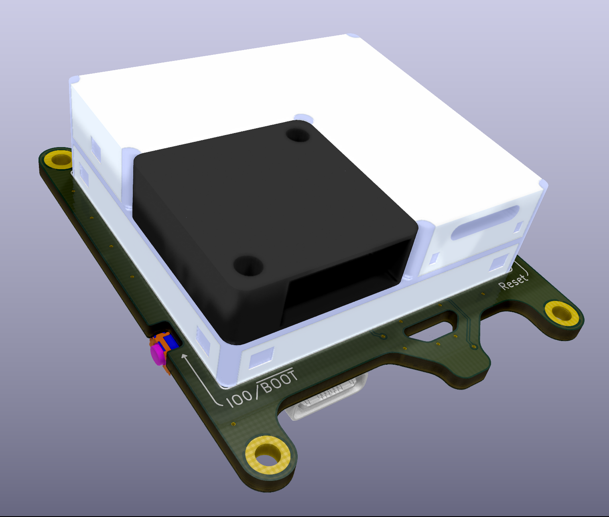

# esp-pmsa

## Repository Structure
- `esp-pmsa` contains the main schematics and board drawing
- `esp-pmsa/esp-pmsa.pretty` contains the board-specific footprints
- `esp-pmsa/shapes3D` contains the 3D models for parts on the board (and a bunch of extras from my various experiments)

## Building
Simply call `make` in the top-top level directory. The `build` directory will then contain:

- the main board
- A panelized version of said board
- zipped gerbers for the boards you can directly use for manufacturing
- zipped gerbers and SMT assembly BOM/position files for JLCPCB's SMT assembly service for the single-board version.

Makefile uses [Jan Mrázek](https://github.com/yaqwsx)'s [KiKit](https://github.com/yaqwsx/KiKit), which I cannot recommend enough, and therefore has to be available on your system.

Jan's [jlcparts](https://yaqwsx.github.io/jlcparts/) app was also extremely useful in narrowing down part choices based on what JLCPCB have available.

-----
### **IMPORTANT NOTE:** If you give JLCPCB these files as-is, *please* verify the orientation of every part before submitting.
